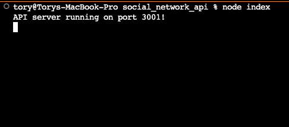
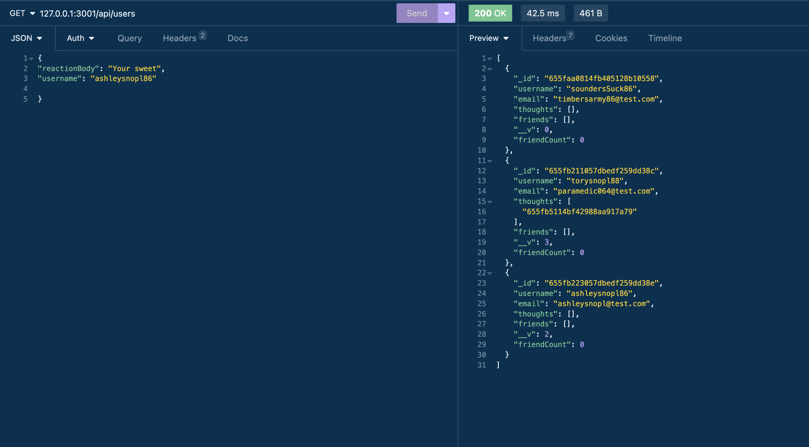

# social_network_api
NoSQL challenge using ExpressJS, Mongoose, and dayJS

## User Story

>AS A social media startup
>I WANT an API for my social network that uses a NoSQL database
>SO THAT my website can handle large amounts of unstructured data

## Acceptance Criteria

>GIVEN a social network API
>WHEN I enter the command to invoke the application
>THEN my server is started and the Mongoose models are synced to the MongoDB database

>WHEN I open API GET routes in Insomnia for users and thoughts
>THEN the data for each of these routes is displayed in a formatted JSON

>WHEN I test API POST, PUT, and DELETE routes in Insomnia
>THEN I am able to successfully create, update, and delete users and thoughts in my database

>WHEN I test API POST and DELETE routes in Insomnia
>THEN I am able to successfully create and delete reactions to thoughts and add and remove friends to a user’s friend list

### Bonus

>Application deletes a user's associated thoughts when the user is deleted.

## Installation

In order to run the program:
- Clone this code into a code editor like VScode
- Open a terminal and navigate to the root folder
- Run the command: NPM I
- Run the command: Node Index
- Open Insomnia to test the routes which can be found in the controllers and routes folders.

If you do not have Insomnia installed, you will need to install it via this [link](https://docs.insomnia.rest/).

## Usage

This application is the backend code to a social media platform allowing users to have friends and react to other users content. This is not a fully functioning platform but rather a demonstration of backend code using mongoose.

## Technologies Used

- Node
- Express
- Day JS
- MongoDB
- Mongoose

## What I Learned

I learned that I really enjoy the looser structure of MongoDB and mongoose. I think it is easier and quicker to build routes. I really like using controllers to build the actual routes in and exporting them so that the routes files in the api are cleaner and easier to follow.

Building the reactions arrays proved to be a bit of a struggle. I was initially trying to use traditional array methods like `.push()` and the save the array. It was much easier and cleaner to use mongoDB methods like `.findOneAndUpdatea()`. I am looking forward to getting more familiar with mongoDB and mongoose on future projects.

## Screenshots

## Demo Video

For a video demonstration of the routes, click [here](https://drive.google.com/file/d/1sgW7-LvkC6CJCreAe0r4TkUBQuCS1YBl/view).

## Source Code

No source code was provided. Some code snippets were used from U of O bootcamp activities. Thank you to askBCS for their support as well. 

## Author

I am a University of Oregon full stack developer bootcamp student. I am looking to collaborate on any type of coding project to hone my skills and expand my knowledge base. Please check out my other projects on [github](https://github.com/TorySnopl). Lets connect via [LinkedIn](https://www.linkedin.com/in/tory-snopl-70b00a283/).

